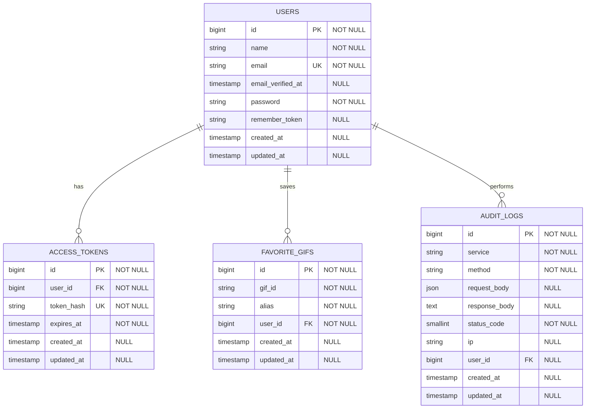

# Diagrama De Datos / DER

## Notas

- `access_tokens.token_hash` almacena el hash `sha256` del token plano.
- `favorite_gifs` tiene una restriccion unica por `user_id` + `gif_id`.
- `audit_logs.user_id` es nullable porque el login se audita antes de existir usuario autenticado en la request.
- `request_body` se guarda como JSON sanitizado.
- `response_body` se guarda como texto raw truncado.

## Indices Y Restricciones

- `users.email`: indice unico para login por email.
- `access_tokens.user_id`: indice por foreign key hacia `users.id`.
- `access_tokens.token_hash`: indice unico para validar tokens de forma eficiente.
- `favorite_gifs.user_id`: indice por foreign key hacia `users.id`.
- `favorite_gifs.user_id + favorite_gifs.gif_id`: indice unico para evitar favoritos duplicados por usuario.
- `audit_logs.user_id`: indice por foreign key hacia `users.id`, nullable para requests sin usuario autenticado.
