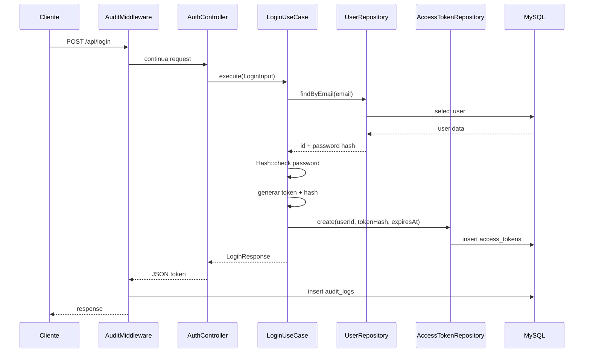
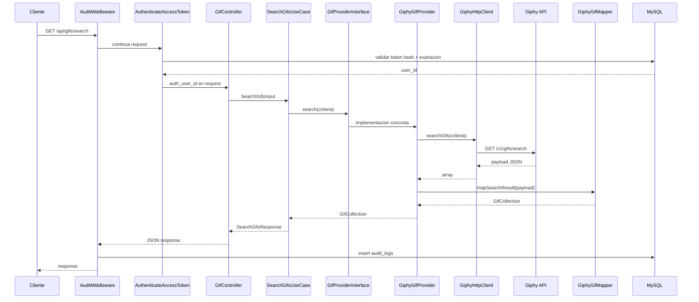
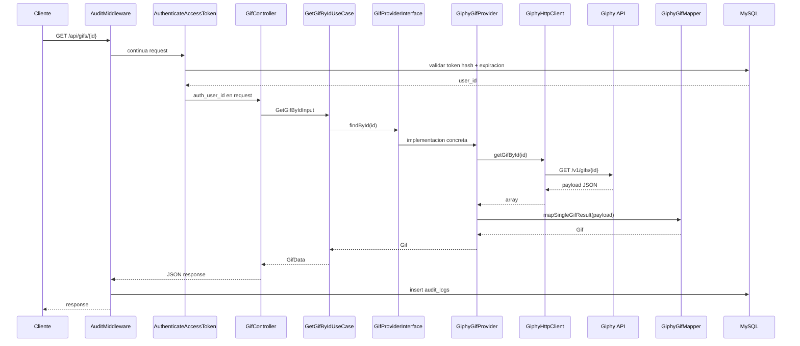
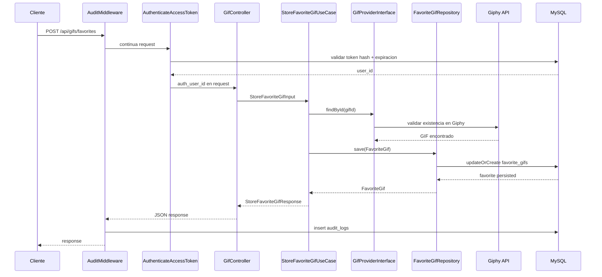

# Diagrama De Secuencia

## Login

```mermaid
sequenceDiagram
    participant Client as Cliente
    participant Audit as AuditMiddleware
    participant Controller as AuthController
    participant UseCase as LoginUseCase
    participant Users as UserRepository
    participant Tokens as AccessTokenRepository
    participant DB as MySQL

    Client->>Audit: POST /api/login
    Audit->>Controller: continua request
    Controller->>UseCase: execute(LoginInput)
    UseCase->>Users: findByEmail(email)
    Users->>DB: select user
    DB-->>Users: user data
    Users-->>UseCase: id + password hash
    UseCase->>UseCase: Hash::check password
    UseCase->>UseCase: generar token + hash
    UseCase->>Tokens: create(userId, tokenHash, expiresAt)
    Tokens->>DB: insert access_tokens
    UseCase-->>Controller: LoginResponse
    Controller-->>Audit: JSON token
    Audit->>DB: insert audit_logs
    Audit-->>Client: response
```

## Buscar GIFs

```mermaid
sequenceDiagram
    participant Client as Cliente
    participant Audit as AuditMiddleware
    participant Auth as AuthenticateAccessToken
    participant Controller as GifController
    participant UseCase as SearchGifsUseCase
    participant Provider as GifProviderInterface
    participant GiphyProvider as GiphyGifProvider
    participant ClientGiphy as GiphyHttpClient
    participant Giphy as Giphy API
    participant Mapper as GiphyGifMapper
    participant DB as MySQL

    Client->>Audit: GET /api/gifs/search
    Audit->>Auth: continua request
    Auth->>DB: validar token hash + expiracion
    DB-->>Auth: user_id
    Auth->>Controller: auth_user_id en request
    Controller->>UseCase: SearchGifsInput
    UseCase->>Provider: search(criteria)
    Provider->>GiphyProvider: implementacion concreta
    GiphyProvider->>ClientGiphy: searchGifs(criteria)
    ClientGiphy->>Giphy: GET /v1/gifs/search
    Giphy-->>ClientGiphy: payload JSON
    ClientGiphy-->>GiphyProvider: array
    GiphyProvider->>Mapper: mapSearchResult(payload)
    Mapper-->>GiphyProvider: GifCollection
    GiphyProvider-->>UseCase: GifCollection
    UseCase-->>Controller: SearchGifsResponse
    Controller-->>Audit: JSON response
    Audit->>DB: insert audit_logs
    Audit-->>Client: response
```

## Obtener GIF Por ID

```mermaid
sequenceDiagram
    participant Client as Cliente
    participant Audit as AuditMiddleware
    participant Auth as AuthenticateAccessToken
    participant Controller as GifController
    participant UseCase as GetGifByIdUseCase
    participant Provider as GifProviderInterface
    participant GiphyProvider as GiphyGifProvider
    participant ClientGiphy as GiphyHttpClient
    participant Giphy as Giphy API
    participant Mapper as GiphyGifMapper
    participant DB as MySQL

    Client->>Audit: GET /api/gifs/{id}
    Audit->>Auth: continua request
    Auth->>DB: validar token hash + expiracion
    DB-->>Auth: user_id
    Auth->>Controller: auth_user_id en request
    Controller->>UseCase: GetGifByIdInput
    UseCase->>Provider: findById(id)
    Provider->>GiphyProvider: implementacion concreta
    GiphyProvider->>ClientGiphy: getGifById(id)
    ClientGiphy->>Giphy: GET /v1/gifs/{id}
    Giphy-->>ClientGiphy: payload JSON
    ClientGiphy-->>GiphyProvider: array
    GiphyProvider->>Mapper: mapSingleGifResult(payload)
    Mapper-->>GiphyProvider: Gif
    GiphyProvider-->>UseCase: Gif
    UseCase-->>Controller: GifData
    Controller-->>Audit: JSON response
    Audit->>DB: insert audit_logs
    Audit-->>Client: response
```

## Guardar GIF Favorito

```mermaid
sequenceDiagram
    participant Client as Cliente
    participant Audit as AuditMiddleware
    participant Auth as AuthenticateAccessToken
    participant Controller as GifController
    participant UseCase as StoreFavoriteGifUseCase
    participant Provider as GifProviderInterface
    participant Repo as FavoriteGifRepository
    participant Giphy as Giphy API
    participant DB as MySQL

    Client->>Audit: POST /api/gifs/favorites
    Audit->>Auth: continua request
    Auth->>DB: validar token hash + expiracion
    DB-->>Auth: user_id
    Auth->>Controller: auth_user_id en request
    Controller->>UseCase: StoreFavoriteGifInput
    UseCase->>Provider: findById(gifId)
    Provider->>Giphy: validar existencia en Giphy
    Giphy-->>Provider: GIF encontrado
    UseCase->>Repo: save(FavoriteGif)
    Repo->>DB: updateOrCreate favorite_gifs
    DB-->>Repo: favorite persisted
    Repo-->>UseCase: FavoriteGif
    UseCase-->>Controller: StoreFavoriteGifResponse
    Controller-->>Audit: JSON response
    Audit->>DB: insert audit_logs
    Audit-->>Client: response
```
