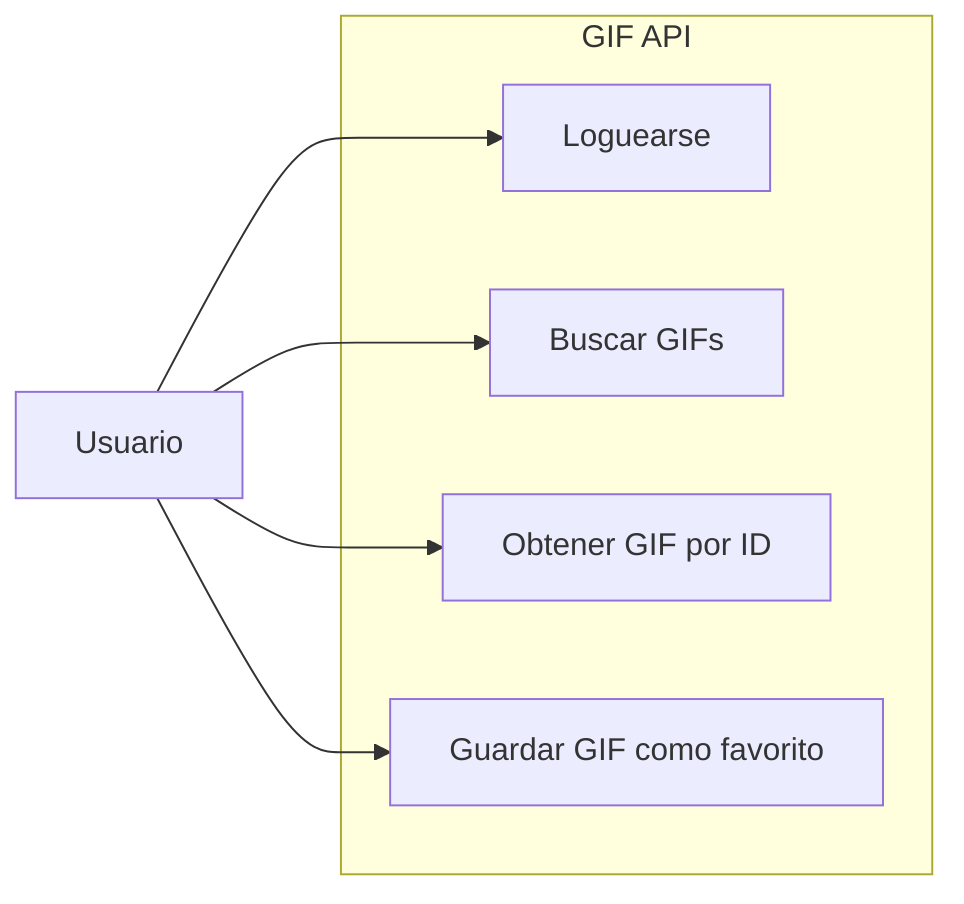

# Diagrama De Casos De Uso

## Descripcion

- El usuario puede loguearse para obtener acceso a la API.
- El usuario puede buscar GIFs por un criterio de busqueda.
- El usuario puede obtener el detalle de un GIF por ID.
- El usuario puede guardar un GIF como favorito.
